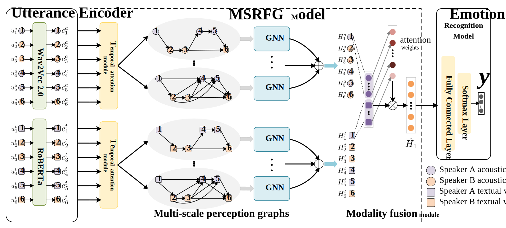

# Multi-Scale Receptive Field Graph Model for Emotion Recognition in Conversations

PyTorch implementation for the paper:

- Title: Multi-Scale Receptive Field Graph Model for Emotion Recognition in Conversations

- Authors: Jie Wei, Guanyu  Hu, Luu Anh Tuan, Xinyu  Yang, Wenjing Zhu

- Submitted to: ICASSP2023





## Getting Started

```git
git clone https://github.com/Janie1996/MSRFG.git
```

## Requirements

You can create an anaconda environment with:

```
conda env create -f environment.yaml
conda activate MSRFG
```

## Usage

### 1. Preparation

a. Download dataset from [google-drive](https://drive.google.com/file/d/1u8nJ7eCCSEJx03aYQN4YRJ6GYHxChcWM/view?usp=sharing). Unzip it and put them under `./data/`

b. Download model checkpoint from [google-drive](https://drive.google.com/file/d/12CnghQiVxkgiqYPN567gAcfpvfFAJrx3/view?usp=sharing). Unzip it and put them under `./checkpoints/`

### 2. Test

- Run IEMOCAP

  `python eval_iemocap.py`

- Run MELD

  `python eval_meld.py`


### 3. Train

Coming soon ...


If you have questions, feel free to contact weijie_xjtu@stu.xjtu.edu.cn

## Acknowledgements

- IEMOCAP: Interactive emotional dyadic motion capture database
- MELD: A Multimodal Multi-Party Dataset for Emotion Recognition in Conversations
- Directed Acyclic Graph Network for Conversational Emotion Recognition